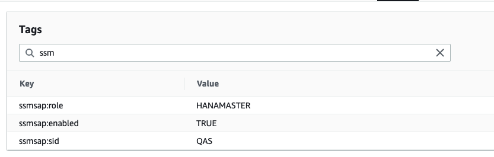
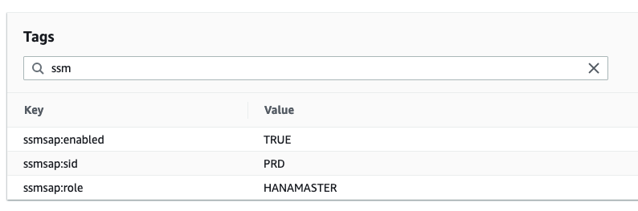
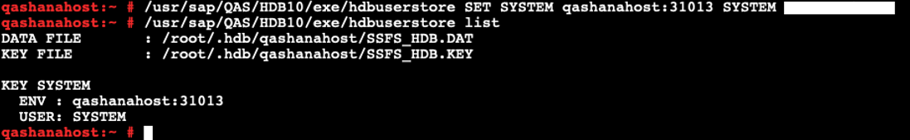
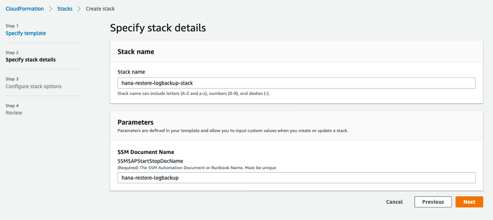

# HANA DATABASE Restore Using SSM Automation Document

## Versions

Version | Author | Date   | Description   
--|---|---|--
  1.0|Ajay Kande  |  05 Oct 2021 | Initial Version, HANA single or distributed.  
  |   |   |  

## Description

This CloudFormation Template will deploy the SSM document which can be used to automate hana database restore.

For more details on its usage see the blog.

## Prerequisites

1. Setup tags to enable and identify the instances as shown below. Note: using a prefix like “ssmsap:” clearly identifies a purpose for the tags and will reduce the likelihood of unrelated changes.

On Source HANA Master Node:

On Target HANA Master Node:

2. Create hdbuserstore key on the target HANA instance with root user as shown. SSM document will use this key to execute restore steps.

## Installation

In CloudFormation, select Create Stack and populate the required parameters or leave them as the defaults, ensuring that they are unique in your account. Select Next, then under configure stack options select Next, review the inputs and select Create Stack. Note: If you are redeploying this template, consider deleting old stacks.

## Usage

Under Systems Manager > Documents > under “Owned by me” > Select the document with the name you specified and click on “Execute automation”. Familiarize yourself with the document by reading through the document and step descriptions.

Provide below input parameters to execute the restore

Option 1: Restore with BACKUP_ID 

Option 2: Restore with BACKUP_ID and Log Backups 

Click “Execute” and you can see the execution status in the next screen. Start time and End time of each step is displayed as shown below. 

Execution status for Restore with BACKUP_ID 

Execution status for Restore with BACKUP_ID and Log Backups 

***
